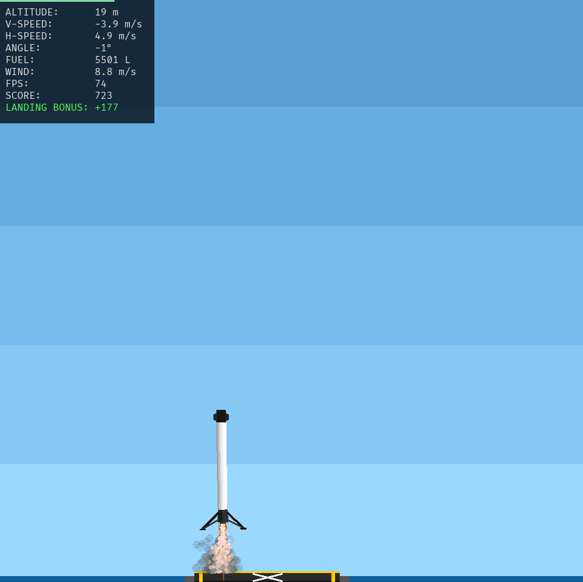

# 🚀 Falcon 9 Lander



A realistic physics-based Falcon 9 landing simulator written in **[Numerobis](https://github.com/rphle/numerobis)** — a programming language with physical units as first-class types.

Land the Falcon 9 booster on the platform safely *and* with style—before you run out of fuel.

## Features

* **Accurate Physics Simulation** — Realistic gravity, aerodynamic drag, wind, and fuel consumption
* **Manual & Autopilot Control** — Fly it yourself or let the autopilot take over
* **Physics-Safe Code** — Built in Numerobis, unit errors are caught at **compile time**, not runtime
* **Headless Mode** — Run large batches for tuning and evaluation

## Quick Start

Make sure you have [Numerobis](https://github.com/rphle/numerobis) installed.

### Build

```bash
nbis build sim.nbis
```

### Play

```bash
./sim
```

## Controls

**Keyboard (manual mode):**

| Key   | Action                                           |
| ----- | ------------------------------------------------ |
| ↑     | **Throttle** — Main engine thrust                |
| ←     | **RCS Left** — Rotate counterclockwise           |
| →     | **RCS Right** — Rotate clockwise                 |
| Space | **Start** mission / reset after crash or landing |
| A     | **Toggle** autopilot                             |
| Q     | **Quit**                                         |
| 0–9   | **Set simulation speed** (0: fastest, 9: slowest)|

**Tip:** Set `INVERT = true` in `consts.nbis` to flip left/right controls.

## Autopilot Mode

Run with the `--autopilot` flag or press `A`:

```bash
./sim --autopilot
```

The autopilot uses a simple PID controller with a three-phase cascading control strategy.
All parameters are configurable via `consts.nbis` or CLI flags like `--attitude_kp 2.8`.

### Batch Evaluation

Evaluate autopilot performance across 10,000 randomized scenarios:

```bash
python eval.py
```

Use `--headless` to disable rendering (you probably want this with `--autopilot`).

Outputs landing accuracy and detailed stats to help tune the controller.
